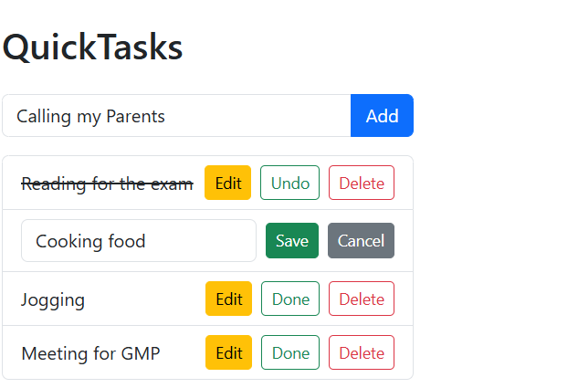

# first_react_project

# 📝 QuickTasks – React + Django Task Manager

**QuickTasks** is a simple full-stack task manager built with:
- ⚙️ **Django REST Framework** for the backend API
- ⚛️ **React.js (Vite)** for the frontend
- 💅 **Bootstrap 5** for UI styling

This project is designed for developers looking to learn how to integrate React with a Django backend using practical CRUD functionality.

---

## 📁 Project Structure

quicktasks/
├── api/ # Django REST API app
├── manage.py
├── db.sqlite3 # SQLite DB
├── quicktasks/ # Django project config
└── quicktasks-frontend/ # Vite + React frontend


---

## 🚀 Features

- ✅ Add new tasks
- ✅ Edit task titles
- ✅ Mark tasks as completed or pending
- ✅ Delete tasks
- ✅ Loading spinner for UX feedback
- ✅ Responsive Bootstrap 5 design

---

## ⚙️ Requirements

- Python 3.10+
- Node.js 16+
- npm or yarn
- Django 5.x
- Django REST Framework
- Vite
- Bootstrap 5

---

## 📦 Backend Setup (Django)

```bash
# 1. Activate your virtual environment
python -m venv venv
venv\Scripts\activate   # On Windows
source venv/bin/activate  # On Linux/macOS

# 2. Install backend dependencies
pip install -r requirements.txt

# 3. Run migrations
python manage.py makemigrations
python manage.py migrate

# 4. Start Django server
python manage.py runserver

Backend runs on: http://127.0.0.1:8000/
API endpoint: http://127.0.0.1:8000/api/tasks/

💻 Frontend Setup (React + Vite)
# 1. Navigate to the frontend folder
cd quicktasks-frontend

# 2. Install frontend dependencies
npm install

# 3. Start Vite development server
npm run dev
Frontend runs on: http://127.0.0.1:5173/

🛠 TODO / Future Improvements
 Add due dates and priorities

 User authentication (JWT)

 Task categories

 Deploy to Render / Netlify / Vercel

 Add Toast notifications

 Unit and integration tests

👨‍💻 Author
Developed by Edward
📍 Uganda | 💊 Pharmaceutical Engineer | 💻 Software Dev Hobbyist

📄 License
This project is open-source and available under the MIT License.
